Here is the comprehensive **OVIS Implementation Specification**.

You can save the content below as a single file named `OVIS_Project_Specs.md`. You can then upload this entire file to Claude Code (or paste it into the context window) so it understands the full scope of the project before writing a single line of code.

-----

# OVIS: Project Specification & Architecture

**Project Name:** OVIS (Custom Agentic CRM)
**Goal:** Build a replacement for Salesforce that features autonomous email ingestion, intelligent tagging, deal synopsis agents, and a "self-correcting" feedback loop.
**Tech Stack:** Python, PostgreSQL, Gmail API, Gemini 1.5 Flash (Agents), Gemini 1.5 Pro (Research).

-----

## 1\. System Architecture

### The "Invisible Bridge" (Ingestion Engine)

The core of OVIS is a zero-touch ingestion engine that mirrors Gmail activity into the CRM database.

  * **Sources:** Monitors `INBOX` and `SENT` labels for all users.
  * **Directionality:** Automatically flags emails as `INBOUND` or `OUTBOUND`.
  * **Deduplication Strategy:** Uses the email `Message-ID` header as the global unique key.
      * *Scenario:* If User A and User B both receive the same email, the content is stored **once** in the `emails` table, but **linked** to both users in the `email_visibility` table.
  * **Threading:** Captures `In-Reply-To` and `References` headers to reconstruct conversation trees.

### The Agentic Workflow

1.  **Triage Agent:** Analyzes new emails to tag them to CRM Objects (Client, Contact, Deal, Property).
2.  **Deal Synopsis Agent:** Reads the entire email history of a Deal to determine "Ball in Court" status (e.g., "Waiting on Landlord").
3.  **Prospecting Agent:** Uses Google Search Grounding to research leads and draft hyper-personalized outreach.

### The "Self-Correcting" Feedback Loop

We do not hard-code complex rules. We "teach" the agent.

1.  User corrects a wrong tag or status in the UI.
2.  Correction is saved to `ai_correction_logs`.
3.  **Dynamic Prompting:** Before analyzing a new email, the Agent fetches relevant past corrections to adjust its behavior.

-----

## 2\. Database Schema Specification

The following schema supports the "Single Source of Truth" architecture.

```sql
-- 1. The Content (Stored ONCE per email)
CREATE TABLE emails (
    id SERIAL PRIMARY KEY,
    message_id VARCHAR(255) UNIQUE NOT NULL, -- The Global Deduplication Key
    thread_id VARCHAR(255),                  -- Gmail Thread ID
    in_reply_to VARCHAR(255),                -- Parent Message-ID
    references TEXT,                         -- Full conversation chain
    direction VARCHAR(10),                   -- 'INBOUND' or 'OUTBOUND'
    subject TEXT,
    body_text TEXT,
    sender_email VARCHAR(255),
    recipient_list TEXT,                     -- JSON list of all recipients
    ai_tags_json JSONB,                      -- Shared tags (Deal/Property IDs)
    created_at TIMESTAMP DEFAULT NOW()
);

-- 2. The Visibility (Links Users to Emails)
CREATE TABLE email_visibility (
    id SERIAL PRIMARY KEY,
    email_id INTEGER REFERENCES emails(id) ON DELETE CASCADE,
    user_id INTEGER REFERENCES users(id),    -- The OVIS User
    folder_label VARCHAR(50),                -- 'INBOX' or 'SENT'
    is_read BOOLEAN DEFAULT FALSE,
    UNIQUE(email_id, user_id)                -- Prevent double-linking
);

-- 3. The Brain (Correction Logs)
CREATE TABLE ai_correction_logs (
    id SERIAL PRIMARY KEY,
    user_id INTEGER REFERENCES users(id),
    email_snippet TEXT,                      -- Context of the mistake
    missed_object_type VARCHAR(50),          -- e.g., "Property"
    correct_association TEXT,                -- e.g., "Property ID 105"
    reasoning_hint TEXT,                     -- e.g., "Blueprints = Property"
    created_at TIMESTAMP DEFAULT NOW()
);
```

-----

## 3\. Implementation Instructions (Prompts for Claude Code)

*Use the following specific instructions to generate the code modules.*

### Module A: The Ingestion Script (Python)

**Prompt to Claude:**

> "Generate a Python script using `google-auth-oauthlib`, `googleapiclient`, and `psycopg2` to implement the 'Invisible Bridge' ingestion logic.
>
> **Core Logic:**
>
> 1.  Authenticate multiple users (placeholder for token management).
> 2.  Poll `INBOX` and `SENT` labels for the last 15 minutes.
> 3.  **Deduplication:** Iterate through messages. extract `Message-ID`.
> 4.  **Try/Except Insert:** Try to insert into the `emails` table.
>       * **If Success (New):** Parse Body, Subject, `In-Reply-To`, `References`. Set `direction`. Then insert into `email_visibility`.
>       * **If UniqueViolation (Duplicate):** Do NOT insert content. Retrieve the existing `id` of that message. Insert into `email_visibility` for the current user.
> 5.  **Output:** Ensure the script handles the 'Race Condition' of two users syncing the same email simultaneously by relying on the Database Constraint."

### Module B: The "Triage Agent" (Gemini Integration)

**Prompt to Claude:**

> "Create a Python class `TriageAgent` that uses the Google Gemini 1.5 Flash API.
>
> **Function:** `analyze_email(email_body, sender, subject)`
>
> **Dynamic Context Step:**
>
> 1.  Query `ai_correction_logs` for the 3 most recent corrections related to this sender or keywords.
> 2.  Inject those corrections into the System Prompt under a section called '\#\#\# LEARNING FROM PAST MISTAKES'.
>
> **System Prompt Requirements:**
>
>   * Role: CRM Data Entry Expert.
>   * Task: Map email to Objects: Client, Contact, Deal, Property.
>   * Logic: If address found -\> Property. If discussing pricing/contract -\> Active Deal.
>   * Output: JSON format only `{ 'tags': [{'type': 'Deal', 'id_guess': '...'}, ...] }`."

### Module C: The "Deal Synopsis" Agent

**Prompt to Claude:**

> "Create a Python function `generate_deal_synopsis(deal_id)`.
>
> **Workflow:**
>
> 1.  Query the `emails` table for ALL emails linked to the given `deal_id`. Order by `created_at` ASC.
> 2.  Concatenate them into a single chronological transcript.
> 3.  Send to Gemini 1.5 Pro (Large Context).
>
> **Analysis Instructions:**
>
>   * Determine 'Ball in Court' (Who owes the next action?).
>   * Identify the status of the latest Key Document (LOI, Lease).
>   * Check for 'Stalled' status (If last email \> User Defined threshold of days).
>   * Output JSON: `{ 'ball_in_court': '...', 'status_summary': '...', 'alert_level': 'Red/Yellow/Green' }`."

### Module D: The Prospecting Agent (Hunter)

**Prompt to Claude:**

> "Create a Python function `run_prospecting_agent(company_name, person_name)`.
>
> **Configuration:**
>
>   * Use Gemini 1.5 Pro.
>   * **CRITICAL:** Enable `tools='google_search_retrieval'` (Grounding).
>
> **Prompt Logic:**
>
> 1.  Search for recent news (last 30 days) on the company.
> 2.  Search for recent social posts by the person.
> 3.  Draft a cold email that connects a specific news item to our value proposition.
> 4.  Return the 'Research Summary' and the 'Draft Email' in JSON."

-----

## 4\. Visual Architecture Reference

*(You can refer to this graph when discussing flow with the developer)*

```graphviz
digraph OVIS_Full_Flow {
    rankdir=LR;
    node [fontname="Helvetica", shape=box, style=filled, fillcolor="#f9f9f9"];

    # Sources
    Gmail_Inbox [label="Gmail\n(Inbox & Sent)", shape=note, fillcolor="#fff3cd"];
    
    # Ingestion
    Script [label="Python Ingestion\n(Deduplication Logic)", style="dashed"];
    
    # Storage
    DB_Emails [label="DB: Emails\n(Single Source)", shape=cylinder, fillcolor="#dae8fc"];
    DB_Links [label="DB: Visibility\n(User Links)", shape=box, fillcolor="#fff2cc"];

    # Intelligence
    Agent_Triage [label="Gemini Agent\n(Triage)", fillcolor="#d5e8d4"];
    Agent_Synopsis [label="Gemini Agent\n(Deal Synopsis)", fillcolor="#d5e8d4"];
    
    # Feedback
    User [label="User UI\n(Corrections)", shape=ellipse, fillcolor="#e1d5e7"];
    DB_Logs [label="DB: Correction Logs", shape=cylinder, fillcolor="#dae8fc"];

    # Flow Connections
    Gmail_Inbox -> Script;
    Script -> DB_Emails [label="Insert Unique"];
    Script -> DB_Links [label="Link User"];
    
    DB_Emails -> Agent_Triage [label="New Email"];
    Agent_Triage -> DB_Emails [label="Update Tags"];
    
    DB_Emails -> Agent_Synopsis [label="Fetch History"];
    Agent_Synopsis -> User [label="Show Status"];
    
    User -> DB_Logs [label="Correct Mistake"];
    DB_Logs -> Agent_Triage [label="Teach Next Run", style="dotted"];
}
```

